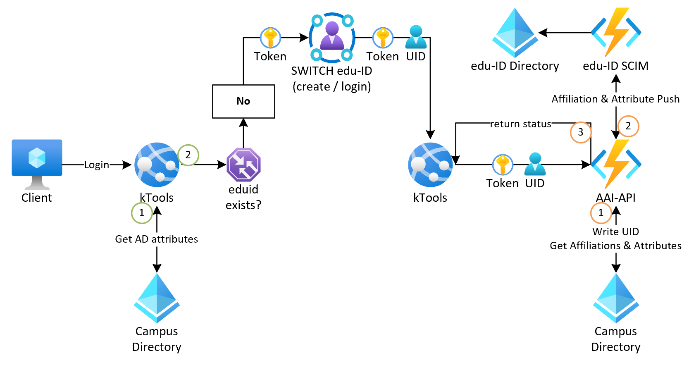
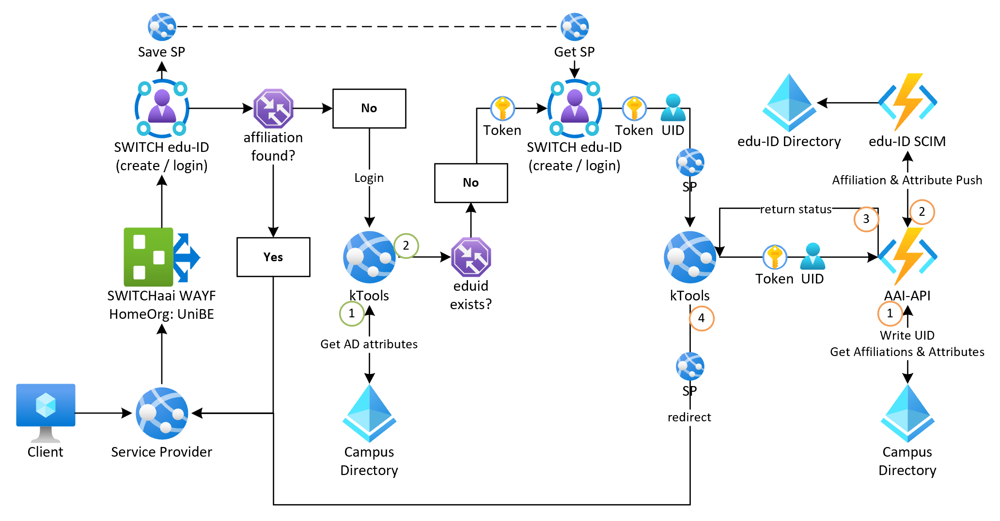

# Linking Prozess mit der AAI-API

Die Verknüpfung der edu-ID mit dem oder den vorhandenen Campus Account(S) einer Person ist eines der zentralen Elemente der SWITCH edu-ID.

Nur hierdurch wird sichergestellt, dass die Nutzenden durch die Auswahl ihrer Home Organization ihre Affiliations angezeigt bekommen und ein Service Provider (SP) wie bis anhin die benötigten Attribute erhält.

Der Linking Prozess kann dabei auf zwei Arten initiiert werden:

- Benutzerinitiiert
- Serviceinitiiert
- Blabla

## Benutzerinitiiert
Beim Benutzerinitiierten Linking Prozess melden sich die Nutzenden an den Ktools an, bspw. um einen neuen Campus Account zu aktivieren oder Informationen anzupassen.

Die Ktools prüfen bei der Anmeldung, ob für die Person im lokalen Benutzerdirectory bereits eine edu-ID hinterlegt ist.  
Ist dies nicht der Fall so wird ein entsprechender Hinweis angezeigt über welchen der Linking Prozess gestartet werden kann:
=> https://ktools.unibe.ch/ktools/edit/eduidLink.xhtml 

## Serviceinitiiert
Dieser Prozess tritt in Kraft wenn sich Nutzende, nach der Umstellung auf die SWITCH edu-ID an der UniBE, an einem Serviceprovider anmelden.  
Können nach der Auswahl der HomeOrg und der anschliessenden Anmeldung mit oder der Erstellung einer edu-ID keine Affiliations gefunden werden, so findet eine Umleitung zum Linking Service der entsprechenden HomeOrg statt.

Der Prozess entspricht grösstenteils dem benutzerinitiierten Linking Prozess, die einzigen Unterschiede bestehen in der Initiierung selbst und darin, dass bei der edu-ID Anmeldung eine Referenz zum Quell-ServiceProvider gespeichert wird.

Diese Information wird während der Verlinkung an den Linking Service übermittelt, so dass dieser den Nutzenden nach der Verlinkung eine Umleitung auf die ursprüngliche Webseite anbieten kann.