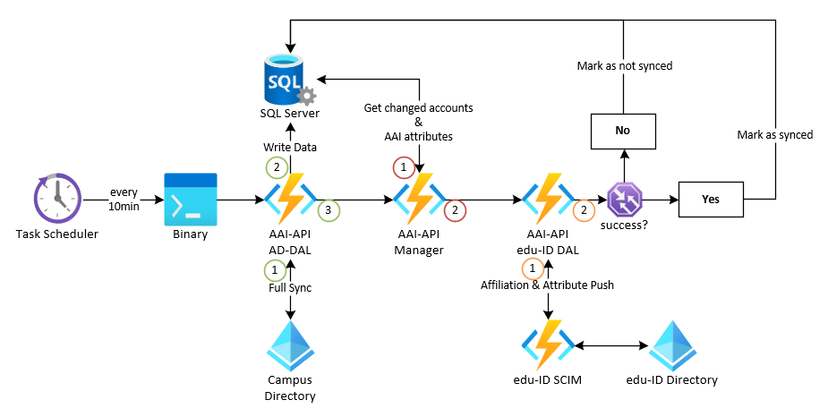

# Linking Prozess mit der AAI-API

!!! note
    Dieser Bereich befindet sich im Aufbau.

Die Verknüpfung der edu-ID mit dem oder den vorhandenen Campus Account(S) einer Person ist eines der zentralen Elemente der SWITCH edu-ID.

Nur hierdurch wird sichergestellt, dass die Nutzenden durch die Auswahl ihrer Home Organization ihre Affiliations angezeigt bekommen und ein Service Provider (SP) wie bis anhin die benötigten Attribute erhält.

Der Linking Prozess kann dabei auf zwei Arten initiiert werden:

- Benutzerinitiiert
- Serviceinitiiert

## Benutzerinitiiert
Beim Benutzerinitiierten Linking Prozess melden sich die Nutzenden an den Ktools an, bspw. um einen neuen Campus Account zu aktivieren oder Informationen anzupassen.

Die Ktools prüfen bei der Anmeldung, ob für die Person im lokalen Benutzerdirectory bereits eine edu-ID hinterlegt ist.  
Ist dies nicht der Fall so wird ein entsprechender Hinweis angezeigt über welchen der Linking Prozess gestartet werden kann:
=> https://ktools.unibe.ch/ktools/edit/eduidLink.xhtml 

Wird der Prozess gestartet, erzeugt Ktools ein Authentication-Token und sendet die Nutzenden auf die SWITCh edu-ID Seite, auf welcher entweder eine Anmeldung mit einer bestehenden edu-ID stattfindet oder aber eine neue edu-ID erstellt wird.

!!! important
    Die SWITCH edu-ID ist ein von der UniBE unabhängiger Account.  
    Es existiert also keine direkte Verbindung von der edu-ID in unser Benutzerverzeichnis.
    Sollte ein Passwort vergessen gehen, können wir keinen Support leisten.

Die UniqueID der edu-ID wird im Anschluss zusammen mit einem entsprechenden Auth-Token zurück an Ktools gesendet.

Ktools bezieht ein Sessions-Token und übermittelt die erhaltene UniqueID der SWITCH edu-ID sowie die Personenidentität an der UniBE an die AAI-Schnittstelle (AAI-API).

Auf der AAI-API werden nun im lokalen Benutzerverzeichnis (Campus Directory) sämtliche, mit der Personenidentität verknüpften Accounts gesucht.  
Auf allen gefundenen Accounts wird die UniqueID der edu-ID als Attribut hinterlegt. Anschliessend werden alle SWITCHaai relevanten Attribute, bspw. die SwissEduPersonUniqueID, ausgelesen.

In einem nächsten Schritt wird eine Verbindung zur SCIM[^1] Schnittstelle der SWITCH edu-ID aufgebaut und für jeden zuvor gefundenen Account, im edu-ID Bereich auch Affiliation genannt, der Status geprüft und je nachdem der edu-ID eine neue Affiliation mit den entsprechenden Attributen hinzugefügt, aktualisiert oder entfernt.  
Waren diese Vorgänge erfolgreich, wird eine Erfolgsmeldung zurück an Ktools gesendet.

Ktools verarbeitet diese Rückgabe und bestätigt den Nutzenden die Verlinkung.

## Serviceinitiiert
Dieser Prozess tritt in Kraft wenn sich Nutzende, nach der Umstellung auf die SWITCH edu-ID an der UniBE, an einem Serviceprovider anmelden.  
Können nach der Auswahl der HomeOrg und der anschliessenden Anmeldung mit oder der Erstellung einer edu-ID keine Affiliations gefunden werden, so findet eine Umleitung zum Linking Service der entsprechenden HomeOrg statt.

Der Prozess entspricht grösstenteils dem benutzerinitiierten Linking Prozess, die einzigen Unterschiede bestehen in der Initiierung selbst und darin, dass bei der edu-ID Anmeldung eine Referenz zum Quell-ServiceProvider gespeichert wird.

Diese Information wird während der Verlinkung an den Linking Service übermittelt, so dass dieser den Nutzenden nach der Verlinkung eine Umleitung auf die ursprüngliche Webseite anbieten kann.

## Regelmässiger Abgleich (Reconciliation)
Es gibt viele Gründe, weshalb eine Übertragung die SCIM Schnittstelle fehlschlagen kann, von der Verfügbarkeit über Netzwerkprobleme aber auch fehlende oder fehlerhafte Attribute.

Um dem entgegenzuwirken führen wir über einen Scheduled Task alle 10min einen vollständigen Abgleich durch.

TODO: Erklärung einfügen

# Technische Details
TODO: Details einfügen

['1] 
    SCIM: System for Cross-domain Identity Management
    Eine Schnittstelle, welche der Übertragung von Identitäten dient.