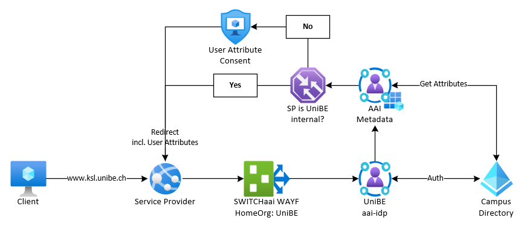
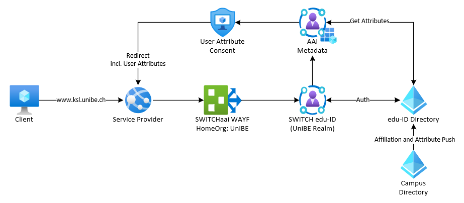
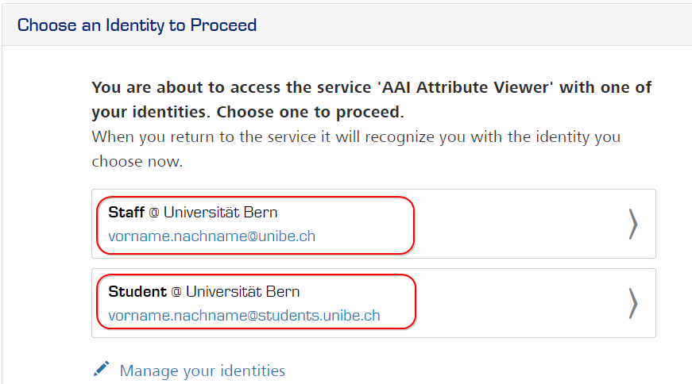

# Anmeldeprozess

Mit der Umstellung von SWITCHaai auf die SWITCH edu-ID wird sich auch der Anmeldeprozess deutlich verändern.  
Nachfolgend sollen dies Änderungen aufgezeigt werden.

## SWITCHaai
Der klassische Anmeldevorgang bei SWITCHaai sieht so aus, dass die Nutzenden via Browser auf die gewünschte Dienstleistung zugreifen.  
Es folgt die Auswahl der Home Organization über den SWITCH WAYF[^1] Service.

Anschliessend erfolgt die Weiterleitung zum Identity Provider der gewählten Home Organization wo die Authentisierung gegen das lokale Benutzerverzeichnis stattfindet.  
Ebenfalls werden hier die vom Service Provider angeforderten Attribute ausgelesen.

Sollte es sich um einen Service Provider innerhalb der UniBE Home Organization handeln, erfolgt nun der Redirect zurück zum Serviceprovider, falls es sich jedoch um einen externen Service Provider handelt, müssen die Nutzenden der Freigabe ihrer Attribute explizit zustimmen bevor der Redirect zurück zum SP geschieht.

## SWITCH edu-ID
Bei der edu-ID verändert sich dieser Prozess im Backendbereich deutlich.

Der initiale Prozess bleibt gleich, sprich, die Nutzenden greifen nach wie vor via Browser auf die gewünschte Dienstleistung zu und wählen ebenfalls die UniBE als Home Organization aus.

!!! warning
    Die Auswahl der UniBE als HomeOrg ist wichtig weil die die edu-ID nur so weiss, welche Affiliations sie zur Auswahl anzeigen soll.

Anstatt, dass nun aber eine Umleitung zum SWITCHaai Identity Provider der UniBE passiert erfolgt eine Umleitung auf die SWITCH edu-ID Plattform auf welcher die Anmeldung stattfindet.  
Dieses System hat keine Anbindung an das lokales Benutzerverzeichnis der HomeOrg. Die Authentifizierung erfolgt also mit einem separaten Benutzerkonto.

Um trotzdem sicherstellen zu können, dass die Service Provider die benötigten Attribute erhalten werden die Accountdaten bei Änderungen im lokalen Benutzerverzeichnis an die SWITCH edu-ID übermittelt.

Sämtliche Accounts des lokalen Benutzerverzeichnisses werden mit einer einzigen edu-ID verknüpft.  
Besitzen die Nutzenden mehr als einen einen Account wird ein Affiliation Chooser angezeigt in welchem der gewünschte Account ausgewählt werden kann.

Ebenfalls kann bei der edu-ID nicht mehr nach internen und externen Dienstleistungen unterschieden werden. Die Nutzenden erhalten also in jedem Fall das User Attribute Consent Fenster angezeigt, in welchem sie Ihre Zustimmung zur Attributfreigabe geben müssen.

[^1]:
    WAYF = Where Are You From
    Hier wird definiert gegenüber welcher Home-Organization die Anmeldung stattfinden soll.