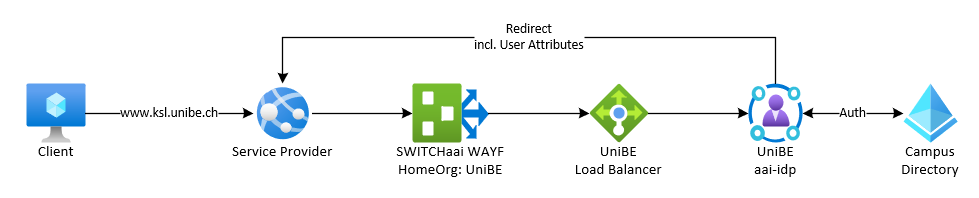
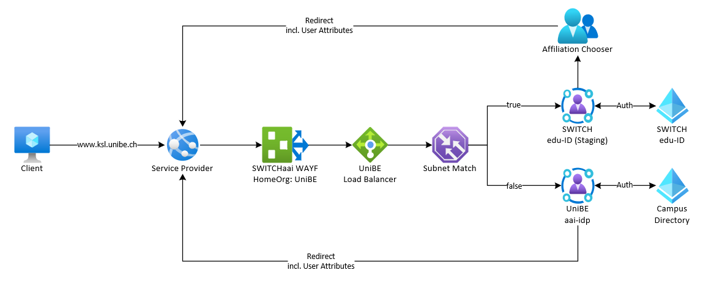
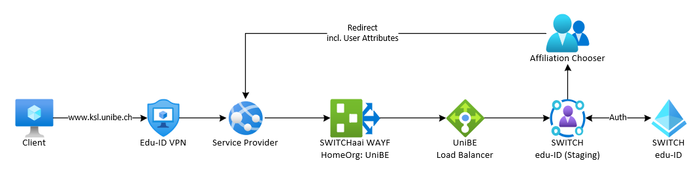
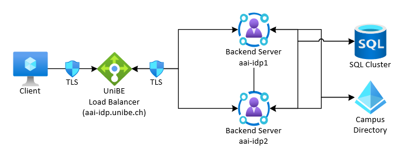
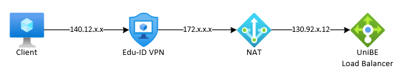

# Funktionsweise des Staging Servers

Der edu-ID Staging Server simuliert das Verhalten nach der Umschaltung von SWITCHaai auf die SWITCH edu-ID an der Universität Bern.

Der Staging Server gibt sich dabei als aai-idp aus, indem er dieselben Datenbanken und Zertifikate nutzt.

Um Ihnen das Testing soweit als möglich zu erleichtern, haben wir einen Load Balancer basierten Ansatz realisiert.  
Dies gibt Ihnen zwei Möglichkeiten die Anmeldung mit der edu-ID an Ihrer Dienstleistung zu testen.

**Anmeldeprozess ohne Staging Server**



## Subnetz Testing
Hierbei leiten wir alle Clients in einem definierten Subnetz an den Staging Server weiter.

**Anmeldeprozess mit Subnet-Matching**


**Vorteil:**

- Es sind keine Client-Anpassungen und Installationen notwendig.

**Nachteile:**

- Alle Clients Ihres Instituts oder Ihrer Abteilung müssen sich im selben Subnetz befinden und das Subnetz muss exklusiv für Sie reserviert sein.
- Nicht sonderlich flexibel.
Es ist nach der Einrichtung nicht möglich zwischen der edu-ID und SWITCHaai Anmeldung zu wechseln.
- Für Studierende nicht möglich.

## VPN Testing (empfohlen)
Bei dieser Methode melden Sie uns die Personen oder Gruppen, welche das Testing durchführen werden.

Diese Personen können sich anschliessend mit einem speziellen VPN Profil verbinden und wodurch der Client an den Staging Server weitergeleitet wird.

**Anmeldeprozess mit dem ext_eduid VPN Profil**


**Vorteile:**

- Sehr flexible Lösung.
Bei aktivierter VPN Verbindung werden Sie auf den Staging Server umgeleitet, bei deaktivierter VPN Verbindung oder einem anderen Profil gelangen Sie wieder zur SWITCHaai Anmeldung.
- Die Lösung steht sowohl auf Desktop-Clients als auch Smartphones und Tablets zu Verfügung.
- Studierende können an den Tests teilnehmen.

**Nachteil:**

- Es muss eine neue VPN-Verbindung eingerichtet und für die Tests verwendet werden.


# Technische Details
Unser Identity Provider ist wie folgt aufgebaut:


F5 NGINXplus, der von uns verwendete Load Balancer, ist dafür zuständig die Nutzenden bei einer Verbindung auf den aai-idp zu einem der beiden IdP Backend-Server weiterzuleiten, den sogenannten upstream servern.

``` nginx
##################################################
## SERVER GROUPS
upstream aai_idp  {
    zone aai_idp 64k;

    least_conn;

    server 130.92.x.x:8443  weight=20 max_fails=0 slow_start=60s;
    server 130.92.x.x:8443  weight=20 max_fails=0 slow_start=60s;

    sticky cookie aai_idp expires=1h domain=.unibe.ch path=/;
}
```

Wenn Sie also aai-idp.unibe.ch ansteuern gelangen Sie effektiv auf den Load Balancer, auf welchem sich auch das TLS Zertifikat befindet welches in Ihrem Browser angezeigt wird.  
Die TLS Verbindung wird an diesem Punkt terminiert. Die Kommunikation vom Load Balancer zu den beiden Backend Server findet mit einem anderen Zertifikat statt.


Der Staging Server ist für uns ein neuer, unabhängiger upstream mit einem eigenen upstream Server, der jedoch nicht in unserem Datenzentrum sondern bei SWITCH betrieben wird.


Die Konfiguration erweitert sich dadurch wie folgt:
``` nginx
##################################################
## SERVER GROUPS
upstream aai_idp  {
    zone aai_idp 64k;

    least_conn;

    server 130.92.x.x:8443  weight=20 max_fails=0 slow_start=60s;
    server 130.92.x.x:8443  weight=20 max_fails=0 slow_start=60s;

    sticky cookie aai_idp expires=1h domain=.unibe.ch path=/;
}

upstream int_aai_idp  {
    zone   int_aai_idp 64k;

    server 130.59.x.x:443;

    sticky cookie int_aai_idp expires=1h domain=.unibe.ch path=/;
}
```

Um nun entscheiden zu können an welchen Upstream ein Client gesendet wird, nutzen wir einen IP basierten Geo-Split:

``` nginx
##################################################
## SPLITS
geo $remote_addr $aai_idp_backend {
    default         https://aai_idp;
    130.92.1.0/24   https://int_aai_idp;
    130.92.2.0/24   https://int_aai_idp;
    130.92.x.12/32  https://int_aai_idp;
}
```

Standardmässig werden hierdurch alle Clients an den SWITCHaai IdP gesendet, ausser das Subnetz entspricht einem der definierten Bereiche, dann gelangt man auf den edu-ID Staging Server.

Damit wir nun nicht jede IP einzeln erfassen müssen nutzen wir den Umstand, dass wir bei Fortinet VPN ein NATting machen.  
Die Nutzenden erhalten also eine IP aus einem privaten Adressbereich, aber nach aussen hin verwenden sie alle dieselbe öffentliche IP Adresse.




Der Vorteil dieses Staging Server Aufbaus liegt auf der Hand; Die Nutzenden müssen keine hosts-Datei anpassen um die Namensauflösung zu manipulieren und erhalten in jedem Fall ein gültiges Zertifikat, da der Datenverkehr nach wie vor über den Load Balancer läuft, welcher darüber entscheidet welches Anmeldesystem verwendet wird.