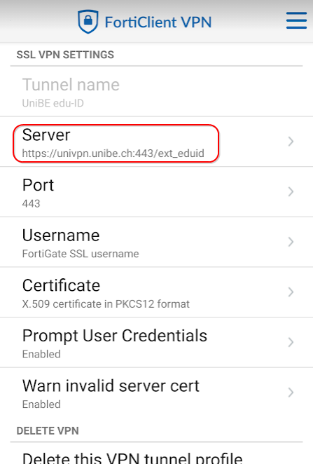
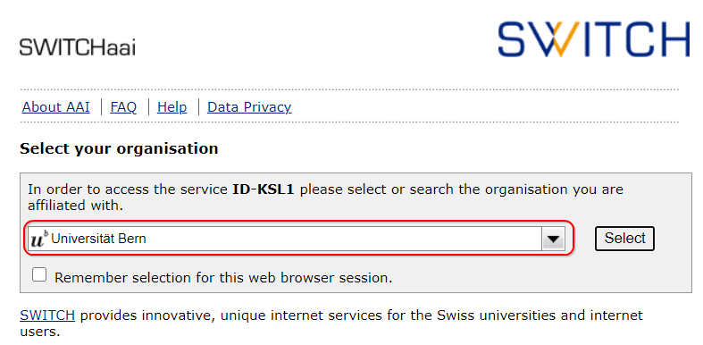
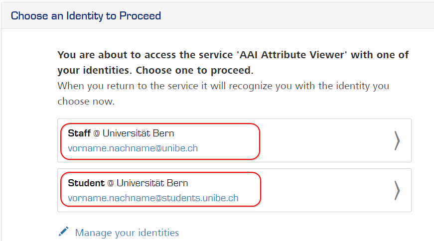

## Verwendung des Staging Servers

### Voraussetzungen
* Der Campus Account wurde mit der edu-ID verlinkt.
* Sie haben uns die Tester an aai@id.unibe.ch gemeldet und eine Bestätigung von uns erhalten.

### Vorgehen
1. Trennen Sie eine eventuell aufgebaute VPN-Verbindung.
2. Erstellen Sie in Ihrem Forticlient VPN ein neues "SSL VPN" Profil mit folgenden Einstellungen:

3. Verbinden Sie sich mit dem neu erstellten Profil unter Verwendung Ihres Campus Accounts.
4. Öffnen Sie einen Incognito Browser und navigieren Sie auf die gewünschte Seite.
5. Wählen Sie auf der SWITCH WAYF[^1] Seite wie gewohnt die ***Universität Bern*** als HomeOrg aus.

6. Sie werden nun für die Anmeldung auf den Staging Server umgeleitet.
7. Melden Sie sich mit Ihrer SWITCH edu-ID an.
Sollten Sie mehrere Affiliations[^2] mit Ihrer edu-ID verknüpft haben, wird Ihnen der Affiliation Chooser angezeigt in welchem Sie die gewünschte Rolle auswählen können.

8. Anschliessend werden Sie zum Service Provider zurückgeführt.

### Prüfen
* War die Anmeldung am gewünschten erfolgreich.
* Hat der Service Provider über den Staging Server dieselben Attribute erhalten wie früher über den aai-idp.

[^1]:
    WAYF = Where Are You From
    Hier wird definiert gegenüber welcher Home-Organization die Anmeldung stattfinden soll.
[^2]: Für jeden Ihrer Campus Accounts erfassen wir bei der edu-ID eine entsprechende Affiliation für Sie.